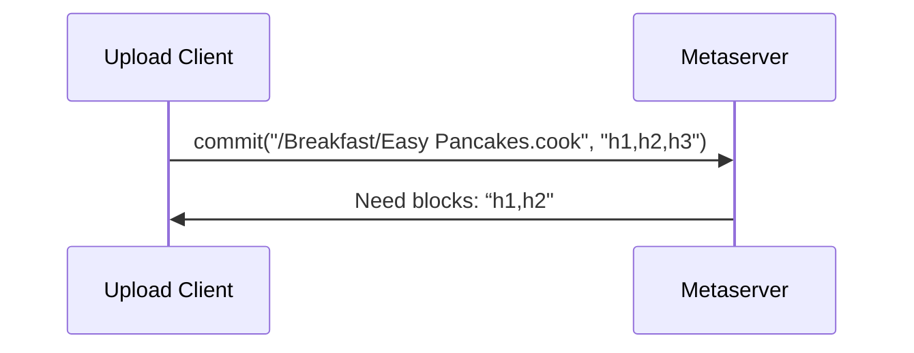
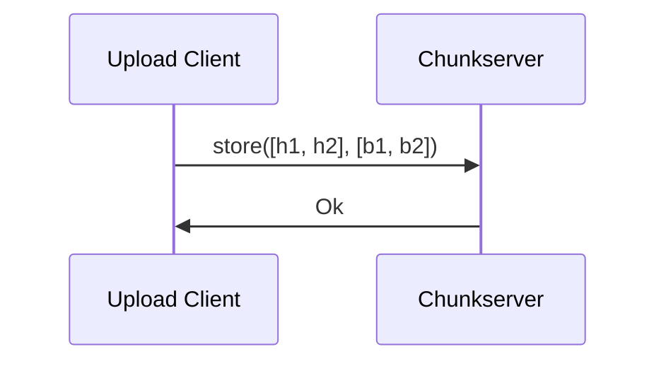
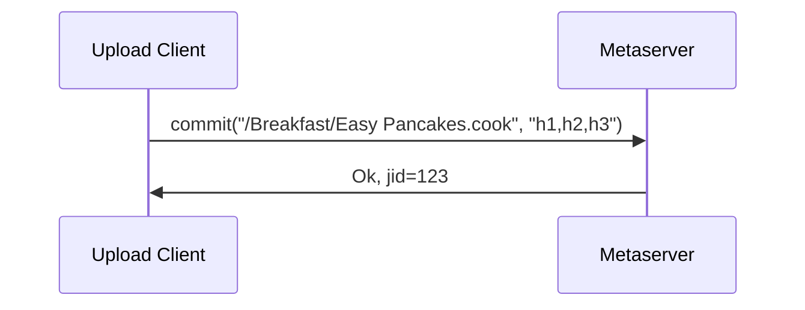
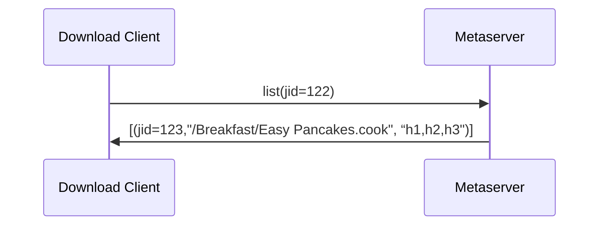
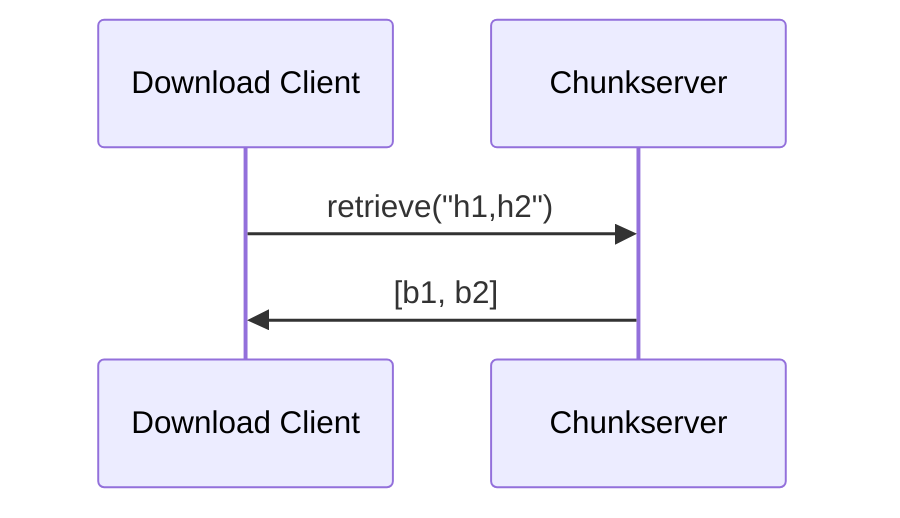

## Upload flow

When client has some local changes they want to upload to remote.

Trying to commit

Uploading chunks requested

Successful commit

Advances local journal to version jid 123.

## Download flow

When remote has changes and a client want to download them.

Advances local journal to version jid 123.
